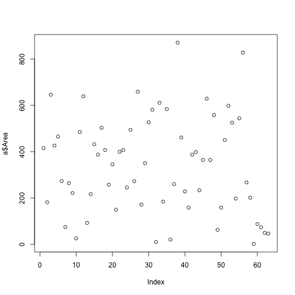

Create a Presentation automatically
========================================================
author: Dani Ushizima
date: 06/29/18
autosize: true

Topics
========================================================

For more details on authoring R presentations please visit <https://support.rstudio.com/hc/en-us/articles/200486468>.

- Bullet 1
- Bullet 2
- Bullet 3

Slide With Code
========================================================


```r
path = "/Users/dani/Dropbox/prog/Apps_IDEAL/tutorials/2017_ucberkeley_course_ZeissCenter/data/images/resultsIris/"
a = read.csv( paste(path,"Results.csv",sep="") )
summary(a)
```

```
       X             Area           Perim.            Circ.       
 Min.   : 1.0   Min.   :  1.0   Min.   :  2.828   Min.   :0.3870  
 1st Qu.:16.5   1st Qu.:182.5   1st Qu.: 52.748   1st Qu.:0.7600  
 Median :32.0   Median :350.0   Median : 68.770   Median :0.8890  
 Mean   :32.0   Mean   :339.9   Mean   : 67.779   Mean   :0.8239  
 3rd Qu.:47.5   3rd Qu.:489.5   3rd Qu.: 86.790   3rd Qu.:0.9115  
 Max.   :63.0   Max.   :871.0   Max.   :130.811   Max.   :1.0000  
       AR            Round           Solidity     
 Min.   :1.000   Min.   :0.2240   Min.   :0.8160  
 1st Qu.:1.169   1st Qu.:0.5675   1st Qu.:0.9210  
 Median :1.328   Median :0.7530   Median :0.9400  
 Mean   :1.632   Mean   :0.7012   Mean   :0.9276  
 3rd Qu.:1.761   3rd Qu.:0.8550   3rd Qu.:0.9480  
 Max.   :4.465   Max.   :1.0000   Max.   :1.0000  
```

Slide With Plot
========================================================


